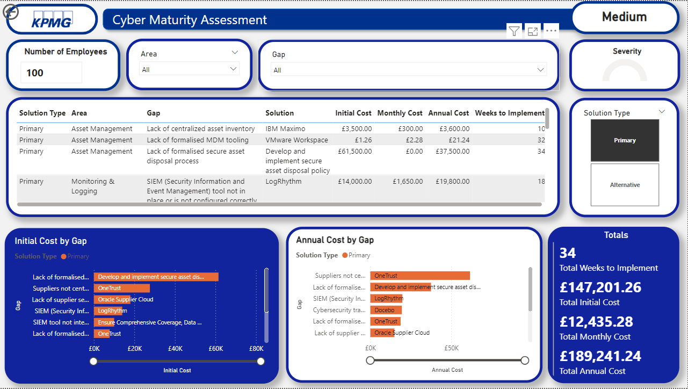
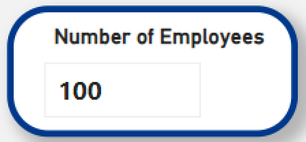
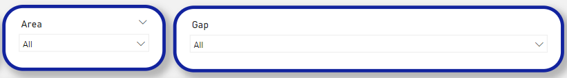
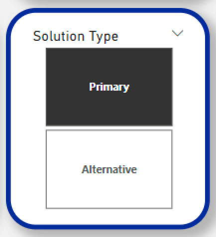
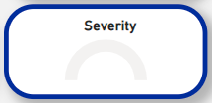
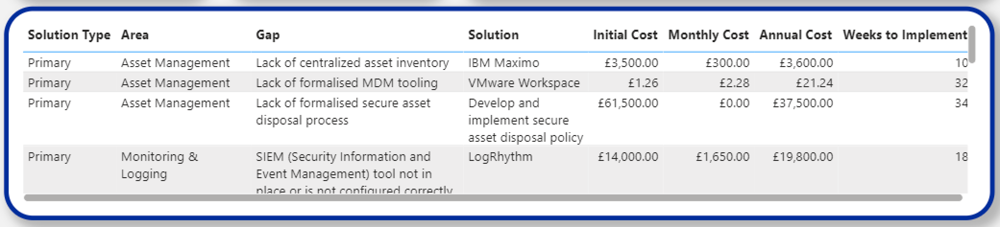
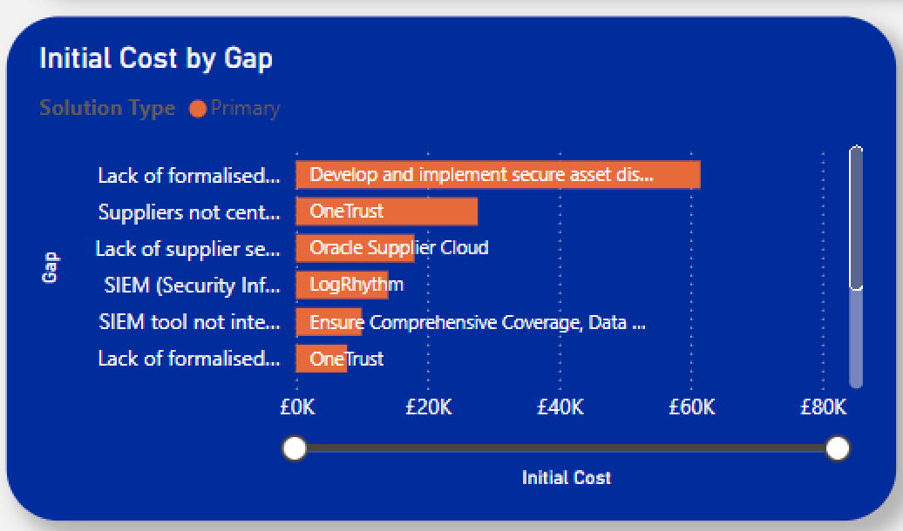
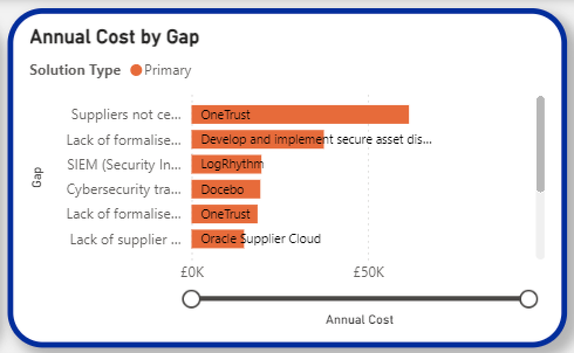
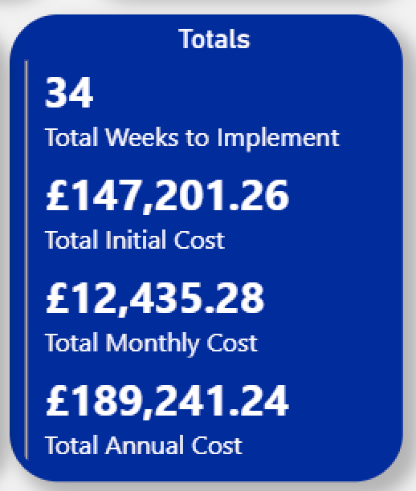

# Cybersecurity-Cost-Dashboard


I created this dashboard as part of my 12 week data analytics bootcamp. The goal was to create an interactive dashboard that users could use to estimate the cost  and implementation time of cybersecurity solutions for their business. 

For this project we partnered with KPMG, who gave us the 5 most common areas of cybersecurity weakness and the specific cybersecurity gaps within those areas. We then researched the current industry leading solutions for each gap and added the pricing and implementation time information.

For each cybersecurity gap we included a primary and alternative solution so that users could compare options.

We also included different options for different sized businesses. These were based on the following scale.

 - Small: 1-49 employees

 - Medium: 50-249 employees

 - Large: 250+ employees

In this way, someone using this dashboard could simply type in how many employees their business had, select the areas and gaps where a weakness had been identfied and they would be shown the fully costed solutions for these problems, along with the time it would take to implement into their business.

## I have included visuals on the following variables:

- Matrix table displaying information
- Initial solution setup cost
- Annual solution cost
- Running summed totals
- Severity gauge

## I have also included filters on the page to help narrow your search. These include:

- 'Number of employees' search bar
- Cybersecurity area dropdown
- Cybersecurity gap dropdown
- Solution type toggle - primary or alternative solution

## I created the following measures that are used in many of the visuals:

- Company Sizing
- Filtered Average Annual Costs
- Filtered Average Initial Costs
- Filtered Average Monthly Costs
- Filtered Implementation Times
- Max Severity
- Severity Colour

## Please read on to find detailed explanations of how I put together different aspects of this dashboard:

# Measures

## Company Sizing

This measure assessed the input to the search bar and returned 'Small', 'Medium' or 'Large' based on the rules established in the code.

```
Company Sizing =
SWITCH(
TRUE(), 
SELECTEDVALUE(‘Number of Employees’[Number of Employees]) <= 49, “Small”,
SELECTEDVALUE(‘Number of Employees’[Number of Employees]) <= 249, “Medium”,
“Large”
)
```

## Filtered Average Initial Costs

This measure filters the average initial cost column and compares it to the previous measure ‘Company Sizing’. In this way it only returns values for companies of the selected size.

```
Filtered Average Initial Costs =
CALCULATE(
    SUM('Final Joined Table'[Average Initial Cost]),
    FILTER(
        'Final Joined Table',
        'Final Joined Table'[Company Size] = [Company Sizing]
    )
)
```

## Filtered Average Monthly Costs

This measure filters the average monthly subscription cost column and compares it to the previous measure ‘Company Sizing’. In this way it only returns values for companies of the selected size.


```
Filtered Average Monthly Costs =
CALCULATE(
    SUM('Final Joined Table'[Average Monthly Cost]),
    FILTER(
        'Final Joined Table',
        'Final Joined Table'[Company Size] = [Company Sizing]
    )
)
```

## Filtered Average Annual Costs

This measure filters the average annual cost column and compares it to the previous measure ‘Company Sizing’. In this way it only returns values for companies of the selected size.

```
Filtered Average Monthly Costs =
CALCULATE(
    SUM('Final Joined Table'[Average Monthly Cost]),
    FILTER(
        'Final Joined Table',
        'Final Joined Table'[Company Size] = [Company Sizing]
    )
)
```

## Filtered Average Implementation Time

This measure filters the average implementation time column and compares it to the previous measure ‘Company Sizing’. In this way it only returns values for companies of the selected size.

```
Filtered Implementation Times = 
CALCULATE(
             SUM(‘Final Joined Table’[Average Implementation Time]),
             FILTER(
                       ‘Final Joined Table’,
                       ‘Final Joined Table’[Company Size]=[Company Sizing]
             )
)
```

## Max Severity

This measure is applied to the gauge visual in the top right of the dashboard. It is set up to detect whether a gap has been selected and if so return the severity. If multiple gaps are selected the highest severity will be shown.

```
Max Severity = 
IF(
ISFILTERED(‘Final Joined Table’[Gap]),
MAX(‘Final Joined Table’[Severity]),
0
)
```

## Severity Colour

This measure is applied to the gauge visual. It displays different colours based on the severity of the gap and is informed by the previous measure. Low severity will be yellow, medium orange and high red.

```
Severity Color = 
SWITCH(
TRUE(),
[Max Severity] = 1, “#FFFF00”, // Yellow
[Max Severity] = 2,  “#FFA500”, // Orange
[Max Severity] = 3, “#FF0000”) // Red
```

# Number of Employees Search Bar



To create the search bar function I used a numeric range parameter ranging from 1 - 1000. I then created a slicer and added that parameter as the slicer field.

Next, I created a card (found in the top right of the dashboard) that will display the company size (small, medium  or large) depending on the number entered into the search bar.

I used a measure to achieve this functionality, the code is shown below.

Company Sizing:


# Area and Gap Dropdown Filters



These are both slicers with the fields set to 'Area' and 'Gap'  respectively. As they are slicers they will filter other visuals on the dashboard.

# Solution Type Toggle



The solution type toggle allows for easy toggling between the primary and alternative solutions. Both can also be selected at once.

# Severity Gauge



This gauge visual is set up to display the severity of the selected cybersecurity gap.

All gaps in our dataset were assigned a number from 1-3 with 1 being a low severity problem and 3 being a high severity problem.

The visual will fill the gauge proportionally to the severity number. It will also change colours for different severity levels.

To create this functionality I used the 'Max Severity' and 'Severity Colour' measures discussed above in the measures section. The 'Max Severity' measure was applied to the value field, whilst I dragged the 'Severity Colour' measure to the tooltips field.

As discussed above in the measures section, the 'Max Severity' measure is set up to check whether any value has been selected in the 'Gap' slicer. If a value has been selected, the gauge will display that gap's severity. 'Severity Colour' will change the gauge colour accordingly.

# Main Table



The main table displays the main information in table format. it can be filtered by company size, area, gap and solution type.

# Initial Cost by Gap - Bar Graph



This bar graph compares the initial costs of selected gaps in an easy to understand format. Bars are labelled and primary and alternative solutions are different colours making them easy to distinguish and compare.

It uses the 'Filtered Average Initial Cost' measure, discussed above in the measures section, on its x-axis. In this way changing the company size will also update this visual.


# Annual Cost by Gap - Bar Graph



This bar graph compares the annual costs of selected gaps in an easy to understand format. Bars are labelled and primary and alternative solutions are different colours making them easy  to distinguish and compare.

It uses the 'Filtered Average Annual Cost' measure, discussed above in the measures section, on its x-axis. In this way changing the company size will also update this visual.

# Running Totals



This final visual on the dashboard shows the running totals of all currently selected gaps, giving transparency to the user about the exact costs of their selected solutions.

# Conclusion

In conclusion, I present a fully interactive and intuitive dashboard, that can easily be used for estimating the cost of rectifying gaps in a company's current cybersceurity.

The created measures and filters successfully link up all tables and visuals, making it seamless to find the information you are looking for.


